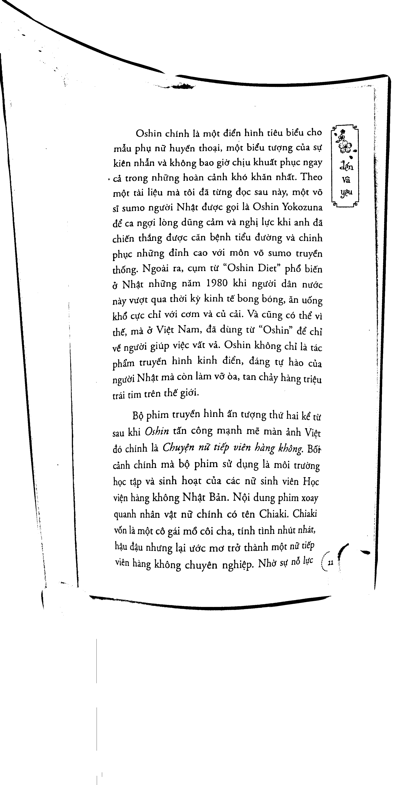
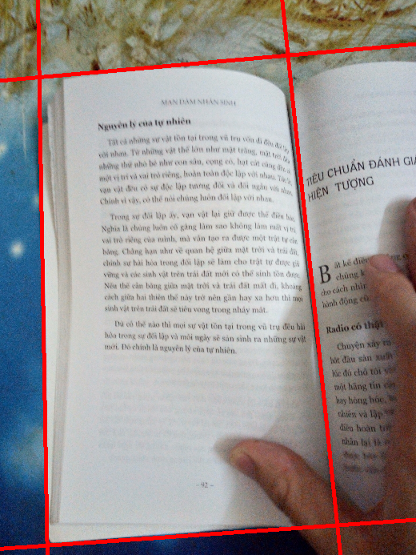
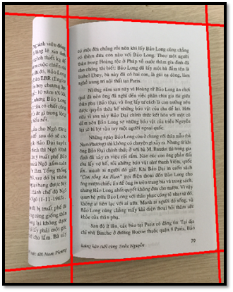
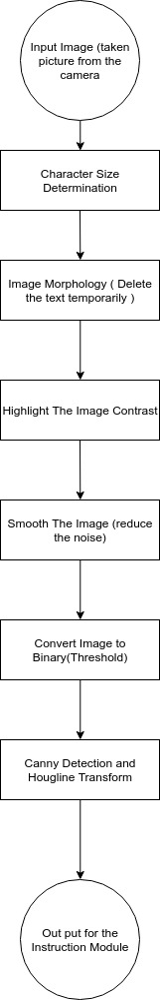
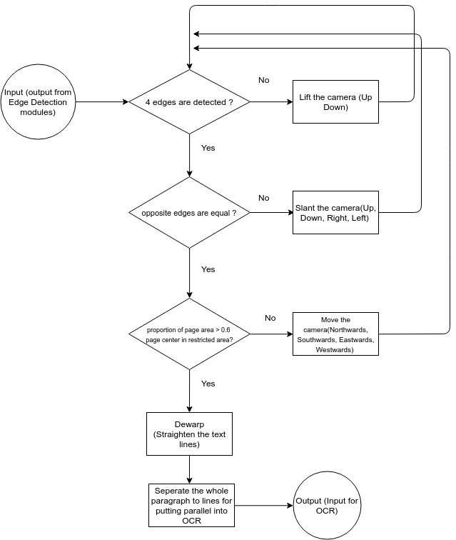

# Prepared Package
----
Install opencv4
Install nlopt

# Build excutable file
----
make

# Result
----
* **Dewarping Result**

Input | Output
|:-------------------------:|:-------------------------:|
 | 

* **Edges Detection Result**

  

* **Architecture**

Edge Detection Module | Instruction Module 
|:-------------------------:|:-------------------------:|
 | 
